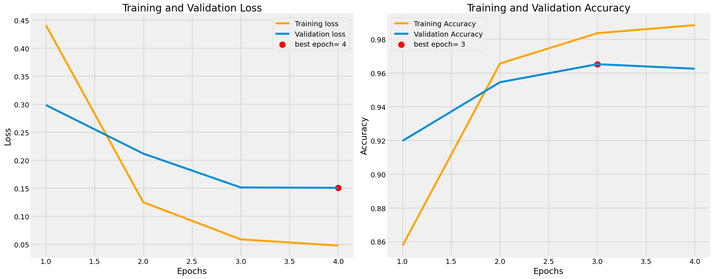

# NLP-ML
sentiment analysis of a text with 7 emotions using the rubert-base-cased model and dataset made by me

Below is the code of the program executed on JupiterLab

```python
import pandas as pd
import tensorflow as tf
import matplotlib.pyplot as plt
import numpy as np
from transformers import TFBertForSequenceClassification, BertTokenizer
from sklearn.model_selection import train_test_split
from sklearn.metrics import accuracy_score, classification_report


# Загрузка и подготовка данных
def prepare_data(file_path):
    # Загрузка данных
    df = pd.read_csv(file_path, sep=';', header=None, names=['label', 'text'], encoding='windows-1251')
    # Разделение на тексты и метки
    X = df['text'].values
    y = df['label'].values
    
    return X, y


# Путь к файлу
file_path = "dataset(text)/train.csv"
# Подготовка данных
X, y = prepare_data(file_path)

# Загрузка токенизатора и модели
model_name = "DeepPavlov/rubert-base-cased"  # или другая версия RuBERT
tokenizer = BertTokenizer.from_pretrained(model_name)
model = TFBertForSequenceClassification.from_pretrained(model_name, num_labels=7, from_pt=True)

# Токенизация данных
def tokenize_data(texts, labels):
    tokenized = tokenizer(
        texts.tolist(),  # Преобразуем в список
        padding=True,
        truncation=True,
        max_length=128,
        return_tensors="tf",
    )
    return tokenized, labels


# Разделение данных на обучающую и валидационную выборки
X_train, X_val, y_train, y_val = train_test_split(X, y, test_size=0.1, random_state=42)

# Токенизация обучающих и валидационных данных
train_encodings, train_labels = tokenize_data(X_train, y_train)
val_encodings, val_labels = tokenize_data(X_val, y_val)

# Преобразование в TensorFlow Dataset
train_dataset = tf.data.Dataset.from_tensor_slices((
    dict(train_encodings),
    train_labels,
)).shuffle(len(train_labels)).batch(16)
val_dataset = tf.data.Dataset.from_tensor_slices((
    dict(val_encodings),
    val_labels,
)).batch(16)

# Компиляция модели
model.compile(
    optimizer=tf.keras.optimizers.Adam(learning_rate=5e-5),
    loss=tf.keras.losses.SparseCategoricalCrossentropy(from_logits=True),  # Для целочисленных меток
    metrics=["accuracy"],
)
# Обучение модели
epochs = 4
history = model.fit(
    train_dataset,
    validation_data=val_dataset,
    epochs=epochs,
)
```
    Epoch 1/4
    421/421 [==============================] - 80s 164ms/step - loss: 0.4412 - accuracy: 0.8577 - val_loss: 0.2985 - val_accuracy: 0.9198
    Epoch 2/4
    421/421 [==============================] - 67s 160ms/step - loss: 0.1248 - accuracy: 0.9656 - val_loss: 0.2118 - val_accuracy: 0.9545
    Epoch 3/4
    421/421 [==============================] - 67s 159ms/step - loss: 0.0587 - accuracy: 0.9836 - val_loss: 0.1514 - val_accuracy: 0.9652
    Epoch 4/4
    421/421 [==============================] - 68s 160ms/step - loss: 0.0476 - accuracy: 0.9884 - val_loss: 0.1508 - val_accuracy: 0.9626
```python  
# Сохранение модели
model.save_pretrained("dataset(text)/models")
tokenizer.save_pretrained("dataset(text)/models")

# Графики обучения
tr_acc = history.history['accuracy']
tr_loss = history.history['loss']
val_acc = history.history['val_accuracy']
val_loss = history.history['val_loss']
index_loss = np.argmin(val_loss)
val_lowest = val_loss[index_loss]
index_acc = np.argmax(val_acc)
acc_highest = val_acc[index_acc]

loss_label = f'best epoch= {str(index_loss + 1)}'
acc_label = f'best epoch= {str(index_acc + 1)}'
Epochs = [i+1 for i in range(len(tr_acc))]

plt.figure(figsize= (20, 8))
plt.style.use('fivethirtyeight')

plt.subplot(1, 2, 1)
plt.plot(Epochs, tr_loss, 'orange', label= 'Training loss')
plt.plot(Epochs, val_loss, label= 'Validation loss')
plt.scatter(index_loss + 1, val_lowest, s= 150, c= 'red', label= loss_label)
plt.title('Training and Validation Loss')
plt.xlabel('Epochs')
plt.ylabel('Loss')
plt.legend()

plt.subplot(1, 2, 2)
plt.plot(Epochs, tr_acc, 'orange', label= 'Training Accuracy')
plt.plot(Epochs, val_acc, label= 'Validation Accuracy')
plt.scatter(index_acc + 1 , acc_highest, s= 150, c= 'red', label= acc_label)
plt.title('Training and Validation Accuracy')
plt.xlabel('Epochs')
plt.ylabel('Accuracy')
plt.legend()

plt.tight_layout()
plt.show()
```


    

    


```python
# Путь к файлу
file_path = "dataset(text)/test.csv"

# Подготовка тестовых данных
X_test, y_test = prepare_data(file_path)

def tokenize_data(texts):
    return tokenizer(
        texts.tolist(),
        padding=True,
        truncation=True,
        max_length=128,
        return_tensors="tf",
    )


test_encodings = tokenize_data(X_test)
test_dataset = tf.data.Dataset.from_tensor_slices((
    dict(test_encodings),
)).batch(16)

# Предсказание на тестовых данных
predictions = model.predict(test_dataset)
predicted_labels = tf.argmax(predictions.logits, axis=-1).numpy()

# Если есть истинные метки, оцениваем модель
if y_test is not None:
    accuracy = accuracy_score(y_test, predicted_labels)
    print(f"Accuracy: {accuracy:.4f}")
    
    # Подробный отчет по классификации
    print(classification_report(y_test, predicted_labels))
else:
    # Если меток нет, просто выводим предсказания
    print("Predicted labels:", predicted_labels)
```
    Accuracy: 0.9786
                  precision    recall  f1-score   support
    
               0       1.00      1.00      1.00        20
               1       1.00      1.00      1.00        20
               2       0.91      1.00      0.95        20
               3       1.00      1.00      1.00        20
               4       1.00      1.00      1.00        20
               5       0.95      1.00      0.98        20
               6       1.00      0.85      0.92        20
    
        accuracy                           0.98       140
       macro avg       0.98      0.98      0.98       140
    weighted avg       0.98      0.98      0.98       140
    
```
